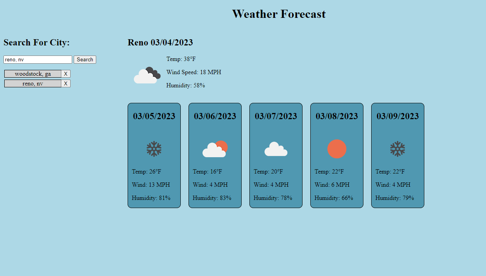

# forecast

## Description
As a user I want to be able to go to a website and get a weather forecast for the City and State that I enter.

When I type in the City and State and click the search button
Then the weather for today is displayed and underneath the current weather is a five day forecast.

When I click the search button
Then my input is validated and saved to a list under the input field if it is valid. If it is not valid I am presented with an alert window.

When I click a saved entry
Then I am presented with weather information for that location.

When I click the delete button
Then that entry is removed from the saved list.

## Installation
N/A

## Usage

https://deweywatkins77.github.io/DevelopmentPortfolio/

will take you to the webpage shown below.

Enter a city and state into the input field using "City, State" format. Then click search. the data is validated. The input is added to the saved list if its valid. The weather will be displayed after clicking search or a saved location is clicked. Click the X button to remove saved entries. 

## License

Refer to Repository License.
